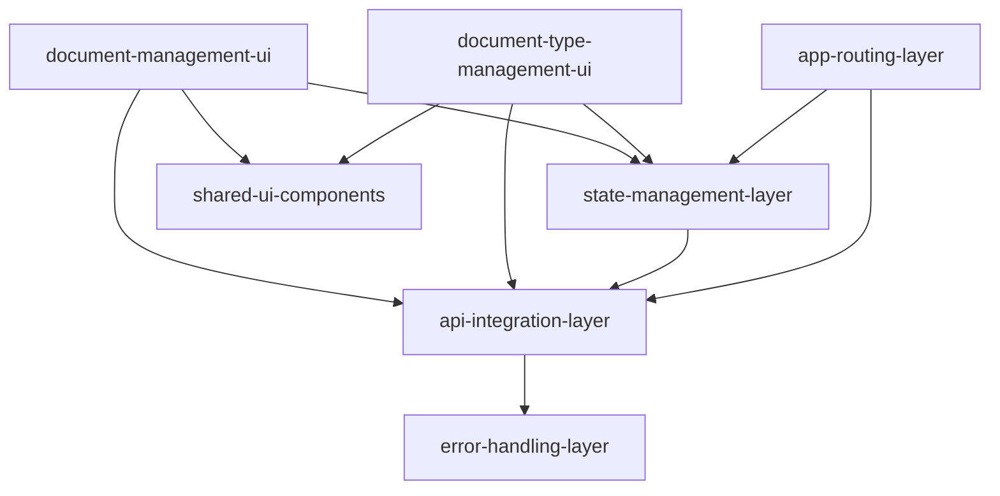

# Module Audit Report

**Project:** asr-alpha-ui (Documatch Document Management System)
**Date:** 2026-01-20
**Analysis Type:** Evidence-based code architecture recovery

---

## Executive Summary

Analyzed **195 TypeScript files** (16,728 LOC) and identified **7 logical modules** in this Next.js 14 application for document processing and management.

**Project Type:** Single-package Next.js application
**Language:** TypeScript 5.6
**Framework:** Next.js 14 (App Router)
**State Management:** Zustand
**UI Library:** Material-UI v6

---

## Discovered Modules

| # | Module ID | Module Name | Type | LOC | Files | Complexity | Priority |
|---|-----------|-------------|------|-----|-------|------------|----------|
| 1 | `api-integration-layer` | API Integration Layer | Infrastructure | 900 | 5 | Medium | 1 |
| 2 | `document-management-ui` | Document Management UI | UI | 2,200 | 15 | High | 2 |
| 3 | `document-type-management-ui` | Document Type (Prompt) Management UI | UI | 2,800 | 17 | Medium | 3 |
| 4 | `state-management-layer` | State Management Layer | Infrastructure | 350 | 6 | Low | 1 |
| 5 | `app-routing-layer` | App Routing Layer | API | 400 | 11 | Medium | 1 |
| 6 | `error-handling-layer` | Error Handling Layer | Infrastructure | 250 | 11 | Low | 2 |
| 7 | `shared-ui-components` | Shared UI Components | UI | 3,500 | 45 | Low | 3 |

---

## Module Details

### 1. API Integration Layer
**ID:** `api-integration-layer`
**Type:** Infrastructure
**Complexity:** Medium

**Description:** HTTP client wrappers for external microservices (Templateless API v2 and User Service API) with authentication, error handling, and request/response utilities.

**Key Files:**
- `src/services/api/index.ts` - Client factory functions
- `src/services/api/TemplatelessApiV2/TemplatelessApiV2Client.ts` - Main document API client (712 lines)
- `src/services/api/UserServiceApi/UserServiceApiClient.ts` - User/org API client

**Key Functions:**
- `getApiClient()` - Returns client-side API client for browser use
- `getServerApiClient()` - Returns server-side API client with Auth0 token injection
- `createDocument(file, definitionOrPromptId, scanMode)` - Upload PDF without processing
- `searchDocuments(filters, sorting, page, pageSize)` - Search with pagination
- `savePageCorrections(documentId, documentPageId, payload)` - Submit user corrections

**Data Models:**
- `TemplatelessApiV2Client` - HTTP client wrapper class
- `DocumentSearchResults` - Paginated search response wrapper
- `PromptCreatePayload` - LLM scanning prompt creation payload

**Dependencies:**
- Internal: `@/constants`, `@/types`, `@/services/api/errors`
- External: `@auth0/nextjs-auth0`, `@nstypes/templateless`

**Integration Points:**
- Templateless API v2 microservice (document processing backend)
- User Service API (user/org management)
- Auth0 authentication (via @auth0/nextjs-auth0)

---

### 2. Document Management UI
**ID:** `document-management-ui`
**Type:** UI
**Complexity:** High

**Description:** Document listing, filtering, pagination, and upload interface for managing processed PDF documents with interactive editing capabilities.

**Key Files:**
- `src/app/document/page.tsx` - Document list page entry point
- `src/components/DocumentList/DocumentList.tsx` - List container (250 lines)
- `src/components/Document/Document.tsx` - Document detail view (268 lines)
- `src/components/DocumentUploadDialog/DocumentUploadDialog.tsx` - Upload dialog (159 lines)

**Key Functions:**
- `DocumentList()` - Main container with filtering, pagination, table display
- `Document(props)` - Detail view with page editing, table row detection, correction submission
- `handleUpload()` - Create document, trigger PDF conversion, show rescan modal
- `handleSave()` - Submit page corrections to backend via API
- `handleRequestTableRowDetection()` - Trigger async table row detection

**Dependencies:**
- Internal: `@/services/api`, `@/stores/global-data-store`, `@/components/DocumentViewer`
- External: `@netsmile/page-edit-component`, `@mui/material`, `next-intl`, `zustand`, `notistack`

**Integration Points:**
- TemplatelessApiV2Client for document CRUD operations
- GlobalDataStore for shared state
- PageEditComponent (@netsmile/page-edit-component) for interactive document editing
- DocumentViewer for PDF rendering

**Notes:**
- Core UI module - primary user interface for document operations
- Uses third-party PageEditComponent for advanced document editing
- Implements optimistic UI updates with snackbar notifications
- Complex state management for pagination, filtering, sorting
- Table row detection is async with polling mechanism

---

### 3. Document Type (Prompt) Management UI
**ID:** `document-type-management-ui`
**Type:** UI
**Complexity:** Medium

**Description:** UI for managing LLM scanning prompts (called "document types" in UI) including creation, editing, listing, and preset selection.

**Key Files:**
- `src/app/document-type/page.tsx` - Document type list page
- `src/components/DocumentTypeList/DocumentTypeList.tsx` - List container
- `src/components/DocumentTypeForm/DocumentTypeForm.tsx` - Create/edit form

**Key Functions:**
- `DocumentTypeList()` - List container with filtering and table display
- `DocumentTypeForm({ handleSubmit, initialPrompt, mode })` - Form for creating/editing LLM prompts
- `handleCreateFromPreset(presetPrompt)` - Copy preset and redirect to edit

**Dependencies:**
- Internal: `@/services/api`, `@/stores/document-type-store`, `@/components/CustomDataGrid`
- External: `@mui/material`, `next-intl`, `zustand`, `@nstypes/templateless`

**Notes:**
- Manages LLM scanning prompts (called "document types" in UI)
- Supports two creation modes: from scratch or from preset
- Field and table prompt configuration with dynamic forms
- Separate store from global document store

---

### 4. State Management Layer
**ID:** `state-management-layer`
**Type:** Infrastructure
**Complexity:** Low

**Description:** Zustand-based state stores for global data, document data, and document types with React context providers.

**Key Files:**
- `src/stores/global-data-store.ts` - Global application state (71 lines)
- `src/stores/document-data-store.ts` - Single document state (30 lines)
- `src/stores/document-type-store.ts` - Document type state (68 lines)
- `src/providers/global-data-store-provider.tsx` - React context provider (111 lines)

**Key Functions:**
- `createGlobalDataStore(initState)` - Factory for global Zustand store
- `createDocumentDataStore(initState)` - Factory for document Zustand store
- `useGlobalDataStore(selector)` - React hook with type-safe selector

**Data Models:**
- `GlobalDataState` - Global app state (search results, filters, definitions, prompts, users)
- `DocumentTypeStore` - Document type state (prompts, search results, filters)

**Dependencies:**
- Internal: `@/services/api`, `@/components/DocumentList/types`
- External: `zustand`, `react`, `@nstypes/templateless`

**Notes:**
- Foundation module - provides state management to all UI modules
- Three separate stores: global (documents), document-type (prompts), document-data (single doc)
- Pagination-aware state with pre-allocated array for cached pages
- Selector-based access pattern for performance optimization

---

### 5. App Routing Layer
**ID:** `app-routing-layer`
**Type:** API
**Complexity:** Medium

**Description:** Next.js 14 App Router pages, layouts, authentication middleware, and server-side data loading.

**Key Files:**
- `src/middleware.ts` - Auth token validation and API proxy (93 lines)
- `src/app/layout.tsx` - Root layout
- `src/app/page.tsx` - Landing page
- `src/load-global-data.tsx` - Server-side data loading

**Key Functions:**
- `middleware(req)` - Auth token validation, expiration checking, API proxy routing
- `loadGlobalData(locale)` - Server-side data loading for global state

**API Contracts:**
- `GET /api/tless/*` - Proxies to TEMPLATELESS_API_V2_URL with Authorization header
- `GET /api/user/*` - Proxies to USER_SERVICE_API_URL with Authorization header

**Dependencies:**
- Internal: `@/services/api`, `@/providers/global-data-store-provider`
- External: `@auth0/nextjs-auth0`, `next`, `jwt-decode`

**Integration Points:**
- Auth0 authentication flow
- Templateless API v2 (via middleware proxy)
- User Service API (via middleware proxy)
- Next.js App Router for SSR and SSG

**Notes:**
- Entry point for all web requests
- Middleware handles token expiration and API proxying
- Server-side data loading for initial page load performance
- Authentication required for all routes except `/`

---

### 6. Error Handling Layer
**ID:** `error-handling-layer`
**Type:** Infrastructure
**Complexity:** Low

**Description:** Custom error type hierarchy for specific API error scenarios with status code mapping.

**Key Files:**
- `src/services/api/errors/ApiCallError.ts` - Base error class
- `src/services/api/errors/ConflictError.ts` - 409 Conflict
- `src/services/api/errors/DocumentNotFoundError.ts` - 404 Document
- `src/services/api/errors/index.ts` - Barrel export

**Key Functions:**
- `ConflictError` - 409 error with `isRequestForCancelledDetection` flag
- `DocumentNotFoundError` - 404 error for missing documents

**Data Models:**
- `ApiCallError` - Base error class with `statusCode` and `message`

**Dependencies:**
- Internal: None
- External: None

**Notes:**
- Inheritance hierarchy: ApiCallError -> NotFoundError/ForbiddenError -> Specific errors
- Status code mapping in `throwIfError` utility
- Used for precise error handling in UI components

---

### 7. Shared UI Components
**ID:** `shared-ui-components`
**Type:** UI
**Complexity:** Low

**Description:** Reusable UI components including buttons, data grids, modals, forms, and utility components.

**Key Files:**
- `src/components/CustomDataGrid/CustomDataGrid.tsx` - MUI X DataGrid Pro wrapper
- `src/components/Dropzone/Dropzone.tsx` - File drop zone for PDF upload
- `src/components/CustomAutocomplete/CustomAutoComplete.tsx` - MUI Autocomplete wrapper
- Plus 40+ other utility components

**Key Functions:**
- `CustomDataGrid({ columns, data })` - Advanced table with sorting/pagination
- `Dropzone({ onDrop, onDelete })` - Drag-and-drop file upload
- `CustomAutoComplete({ options, onChange })` - Consistent autocomplete styling

**Dependencies:**
- Internal: `@/constants`, `@/types`
- External: `@mui/material`, `@mui/x-data-grid-pro`, `@mui/x-date-pickers-pro`, `react-dropzone`

**Notes:**
- Component library used across the application
- Wrappers around MUI components for consistent styling
- No business logic - purely presentational

---

## Dependency Graph



**Dependency Map:**
- `document-management-ui` → `api-integration-layer`, `state-management-layer`, `shared-ui-components`
- `document-type-management-ui` → `api-integration-layer`, `state-management-layer`, `shared-ui-components`
- `state-management-layer` → `api-integration-layer`
- `app-routing-layer` → `api-integration-layer`, `state-management-layer`
- `api-integration-layer` → `error-handling-layer`

---

## Technology Stack

**Frontend Framework:**
- Next.js 14.2.15 (App Router)
- React 18.3.1
- TypeScript 5.6.3

**UI Libraries:**
- Material-UI (MUI) 6.1.4
- MUI X DataGrid Pro 6.20.4
- MUI X Date Pickers Pro 7.21.0

**State Management:**
- Zustand 5.0.0

**Data Fetching:**
- Native Fetch API with custom wrapper clients

**Authentication:**
- Auth0 Next.js SDK 3.5.0

**Internationalization:**
- next-intl 3.22.0

**Third-Party Components:**
- @netsmile/page-edit-component (Document editing)
- @nstypes/templateless (Type definitions)

**PDF Handling:**
- pdfjs-dist 3.4.120
- konva 9.3.18, react-konva 18.2.10 (Canvas rendering)

---

## Recommended Adoption Order

To create specifications for this codebase, follow this order:

1. **error-handling-layer** (Foundation - no dependencies)
2. **api-integration-layer** (Foundation - minimal deps)
3. **state-management-layer** (Depends on API layer)
4. **app-routing-layer** (Orchestrates everything)
5. **document-management-ui** (Core feature)
6. **document-type-management-ui** (Core feature)
7. **shared-ui-components** (Can be adopted anytime)

---

## Next Steps

To create a specification for a module, run:

```bash
/specledger.adopt --module-id [MODULE_ID] --from-audit
```

**Example:**
```bash
# Create spec for API integration layer
/specledger.adopt --module-id api-integration-layer --from-audit

# Create spec for document management UI
/specledger.adopt --module-id document-management-ui --from-audit
```

---

## Warnings and Risks

1. **External Dependency:** `document-management-ui` has tight coupling to `@netsmile/page-edit-component` - verify this external library is documented and available

2. **Critical Proxy:** API proxying in `middleware.ts` is critical - failure breaks all external communication

3. **State Complexity:** State management has three separate stores - consider if this complexity is necessary or can be consolidated

4. **Async Polling:** Table row detection in Document component uses async polling - may have race conditions under high load

5. **Token Management:** Auth token expiration checking happens in middleware on every request - may impact performance

---

## Files Generated

- `scripts/audit-cache.json` - Machine-readable full analysis
- `scripts/audit-report.md` - This human-readable summary
- `scripts/module-graph.dot` - Dependency graph in Graphviz format (optional)

**Total Analysis Time:** ~20 minutes
**Files Analyzed:** 195 TypeScript files
**Lines of Code:** 16,728
**Modules Identified:** 7
